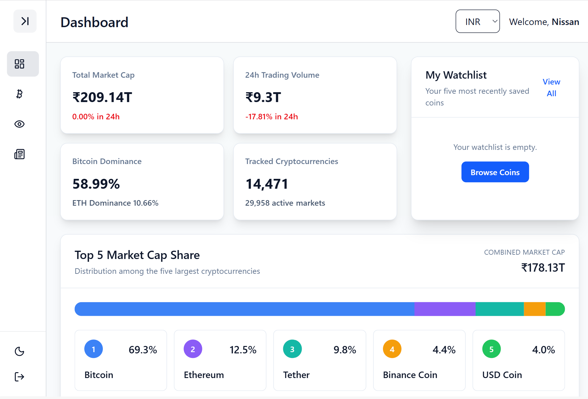

# CoinLume

**Crypto markets, clearly illuminated.**

CoinLume is a responsive cryptocurrency dashboard built with React. It brings market statistics, cryptocurrency prices, watchlists, coin details, historical charts, news, theme controls, and currency conversion into one interface.

## Live Demo

**[Open CoinLume](https://coinlume-crypto-dashboard-l8uu.vercel.app/dashboard)**

Demo login:

```text
Username: user
Password: 1234
```

## Screenshots

### Dashboard


### Dashboard — Alternate View



### Dark Mode


### Coins


### Coin Details


### Mobile View


## Features

- Responsive crypto market dashboard
- Protected login and logout flow
- Global cryptocurrency market statistics
- Top 50 cryptocurrency table
- Search cryptocurrencies by name
- Sort market data by rank, name, price, 24-hour change, market cap, and volume
- Pagination for Coins and Watchlist pages
- Add and remove cryptocurrencies from a personal watchlist
- Watchlist persistence using `localStorage`
- Coin detail pages with overview and market information
- Historical cryptocurrency price chart
- Exchange/market data for individual coins
- Multi-currency price display
- Shared currency formatting across the application
- Light and dark themes
- Sticky sidebar and header
- Crypto news and insights
- Loading, error, retry, and empty states for API-driven content
- Responsive layouts for desktop, tablet, and smaller screens

## Tech Stack

- **React**
- **Vite**
- **Tailwind CSS**
- **React Router**
- **Redux Toolkit**
- **React Context API**
- **Recharts**
- **Lucide React**
- **CoinLore API**
- **localStorage**
- **Vercel**

## Main Pages

### Dashboard

The Dashboard gives the user a quick overview of the cryptocurrency market.

It includes:

- global market statistic cards
- Top 5 Market Cap Share visualization
- top cryptocurrencies
- watchlist preview
- crypto insights/news preview

### Coins

The Coins page displays the top 50 cryptocurrencies received from the CoinLore API.

Users can:

- search coins
- sort the table
- move between pages
- change the displayed currency
- add or remove coins from the watchlist
- open a coin's detail page

### Coin Details

Each cryptocurrency has its own detail route.

The page includes:

- coin overview
- current market information
- project/profile information
- historical price chart
- exchange market data
- external links where available

### Watchlist

The Watchlist page displays only cryptocurrencies saved by the user.

It supports:

- persistent saved coin IDs
- search
- sorting
- pagination
- currency formatting
- removing saved coins
- navigation to Coin Details

### News

The News page provides cryptocurrency-related stories and market insights in a dedicated section of the application.

## Project Structure

```text
src/
├── app/
│   └── store.js
├── component/
│   ├── CoinInformation.jsx
│   ├── CoinMarkets.jsx
│   ├── CoinOverview.jsx
│   ├── CoinPriceChart.jsx
│   ├── Header.jsx
│   ├── MarketStatCard.jsx
│   ├── NewsPreview.jsx
│   ├── PaginationControls.jsx
│   ├── ProtectedRoute.jsx
│   ├── SearchSortControls.jsx
│   ├── Sidebar.jsx
│   ├── ThemeToggle.jsx
│   ├── TopCryptocurrencies.jsx
│   └── WatchlistPreview.jsx
├── context/
│   ├── AuthContext.jsx
│   └── ThemeContext.jsx
├── features/
│   ├── coins/
│   │   └── CoinsSlice.js
│   ├── currency/
│   ├── market/
│   └── watchlist/
├── layout/
│   └── AppLayout.jsx
├── pages/
│   ├── CoinDetailsPage.jsx
│   ├── CoinsPage.jsx
│   ├── DashboardPage.jsx
│   ├── LoginPage.jsx
│   ├── NewsPage.jsx
│   └── WatchlistPage.jsx
├── utils/
│   └── formatCurrency.js
├── App.jsx
└── main.jsx
```

## Application Architecture

CoinLume uses different state-management approaches based on the type of state being handled.

### Redux Toolkit

Redux manages application data that is shared across several pages and components:

- cryptocurrency data
- global market statistics
- selected currency and currency rates
- watchlist coin IDs

### React Context

Context is used for application-wide UI/session state:

- authentication
- light/dark theme

### localStorage

`localStorage` preserves user-facing state between refreshes, including:

- authentication information
- selected theme
- selected currency
- saved watchlist coins

## Data Flow

A simplified example of the coin data flow is:

```text
CoinLore API
    ↓
fetchCoins async thunk
    ↓
Coins Redux slice
    ↓
Redux store
    ↓
Dashboard / Coins / Watchlist / Coin Details
```

The application fetches the data once through shared Redux state and reuses it across multiple pages.

## Currency Conversion

CoinLume stores the selected currency and conversion rates in Redux.

A shared utility:

```text
formatCurrency(value, selectedCurrency, rates, compact)
```

is used to:

1. convert the original USD value
2. apply the selected currency rate
3. format the result consistently
4. optionally display large values in compact form

This avoids repeating currency-formatting logic across components.

## Watchlist Design

The watchlist stores only coin IDs instead of copying complete cryptocurrency objects.

Example:

```text
["90", "80", "58"]
```

The application then matches those IDs against the latest cryptocurrency data.

This keeps the saved state small and avoids storing outdated market information.

## Search, Sorting and Pagination

The Coins and Watchlist pages process the data in this order:

```text
API/Redux data
    ↓
Search filter
    ↓
Sorting
    ↓
Pagination
    ↓
Rendered table
```

Pagination is applied after filtering and sorting so the user always sees the correct results for the selected search and sort settings.

The tables also use fixed layouts and controlled widths to prevent long cryptocurrency names from changing the column sizes while searching.

## Error Handling

API-driven sections include states for:

- loading
- success
- failure
- retry
- empty results

For example, the Coin Markets section can distinguish between:

```text
Loading data
Failed request
No market data available
Successful market data
```

rather than treating every empty array as the same situation.

## Responsive Design

CoinLume uses responsive Tailwind utilities to adapt the layout for different screens.

Examples include:

```text
Mobile      → sections stack vertically
Tablet      → selected sections use multiple columns
Desktop     → full dashboard layout
```

Large cryptocurrency tables use horizontal scrolling on smaller screens instead of compressing every column until the data becomes unreadable.

## Important Project Decisions

### Top 5 Market Cap Share

A more complex whole-market visualization was considered, but the available free API data made it unnecessarily complicated.

The final dashboard therefore uses a simpler Top 5 Market Cap Share visualization based on the cryptocurrency data already available in the project.

### Historical Chart Currency

Currency conversion is applied to normal monetary values throughout the application.

The historical chart keeps its original API values because converting every historical point, axis value, and tooltip would add significant complexity without being essential to the main project goals.

### Shared Components

Repeated controls were moved into reusable components such as:

- `SearchSortControls`
- `PaginationControls`
- `MarketStatCard`

This keeps the pages easier to read and avoids duplicating the same interface logic.

## Local Development

### Clone the repository

```bash
git clone <your-repository-url>
cd coinlume-crypto-dashboard
```

### Install dependencies

```bash
npm install
```

### Start the development server

```bash
npm run dev
```

Vite will display the local development URL in the terminal.

## Available Scripts

```bash
npm run dev
npm run build
npm run lint
npm run preview
```

### Production Build

```bash
npm run build
```

The project has been successfully built and deployed to Vercel.

## Deployment

CoinLume is deployed using Vercel.

Live application:

**https://coinlume-crypto-dashboard-l8uu.vercel.app/dashboard**

Because the project uses React Router, SPA routing must be configured so routes such as `/coins/:id`, `/watchlist`, and `/news` continue to work when opened or refreshed directly.

## What I Learned

Building CoinLume involved more than displaying API data. The project required connecting several parts of a React application together, including:

- deciding which state belongs in Redux and which belongs in Context
- sharing API data between multiple pages
- building reusable UI controls
- persisting user choices
- handling loading and failure states
- filtering and sorting data before pagination
- formatting currency values consistently
- building protected routes
- improving responsive layouts
- debugging case-sensitive import problems during deployment
- preparing a Vite application for production deployment

One important deployment lesson was that Windows file paths are usually case-insensitive while Vercel builds on Linux. Import paths and filenames therefore need to match exactly.

## Future Improvements

Possible future improvements include:

- route-based code splitting
- stronger production authentication
- additional historical chart ranges
- richer news integration
- additional market analytics
- improved mobile navigation
- automated testing

These were intentionally kept outside the current project scope.

## Disclaimer

Market data is provided for informational purposes only and may be delayed, incomplete, or inaccurate.

**CoinLume does not provide financial advice.**

## Author

Built as a React portfolio/capstone project.

## License

This project was created for learning and portfolio purposes.
