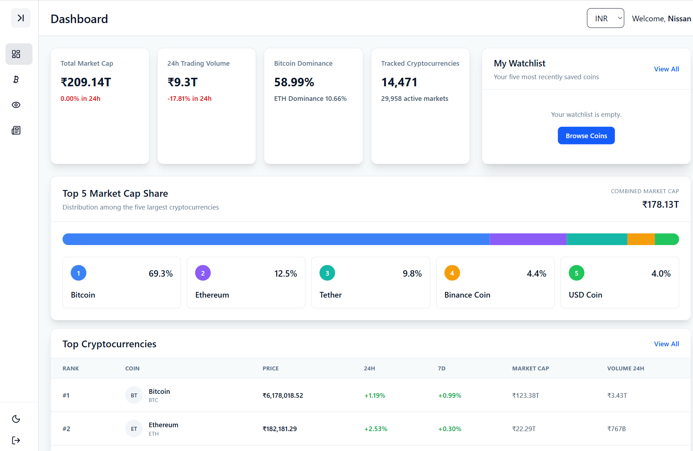
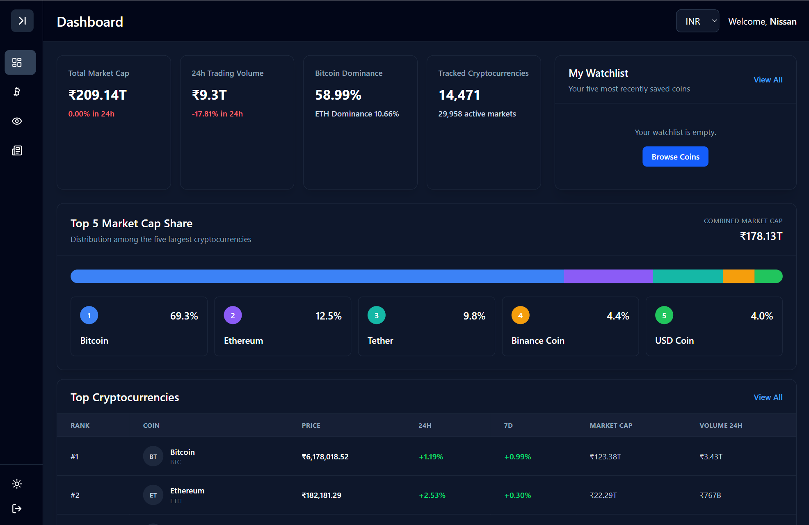
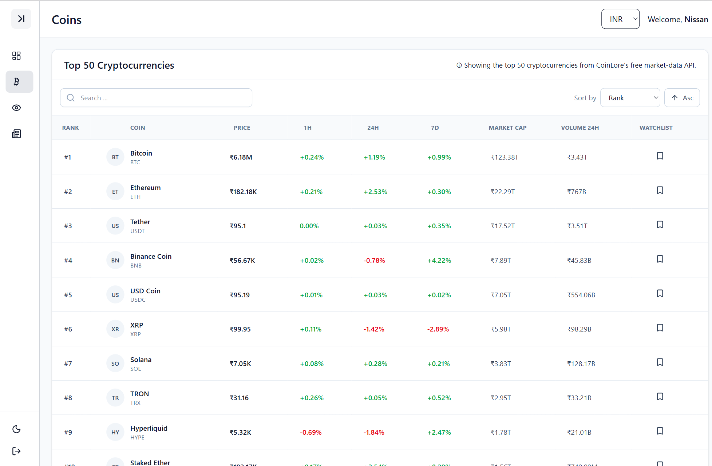
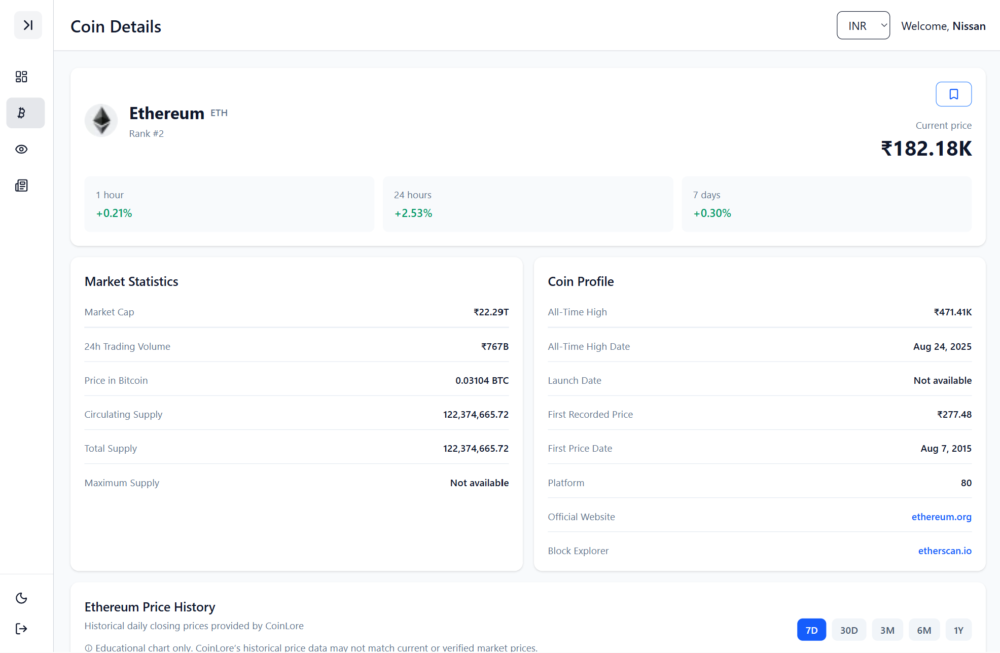
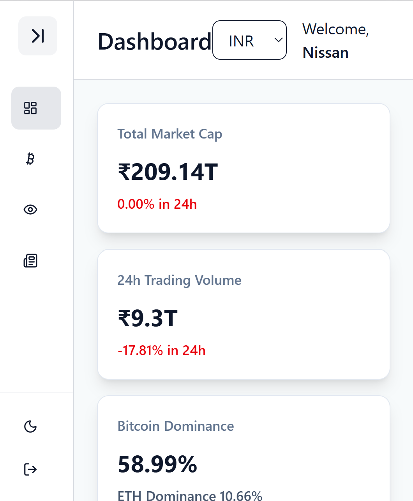

# CoinLume

**Crypto markets, clearly illuminated.**

CoinLume is a responsive cryptocurrency dashboard built with React. It combines market statistics, cryptocurrency prices, watchlists, coin details, historical charts, currency conversion, news, and theme controls in one interface.

## Live Demo

**https://coinlume-crypto-dashboard-l8uu.vercel.app/dashboard**

Demo login:

```text
Username: user
Password: 1234
```

## Screenshots

### Dashboard



### Dark Mode



### Coins



### Coin Details



### Mobile View



## Features

- Responsive crypto market dashboard
- Protected login flow
- Global market statistics
- Top 50 cryptocurrency table
- Search, sorting, and pagination
- Persistent watchlist
- Coin detail pages
- Historical price chart
- Exchange market data
- Multi-currency display
- Light and dark themes
- Sticky sidebar and header
- Loading, error, retry, and empty states

## Tech Stack

- React
- Vite
- Tailwind CSS
- React Router
- Redux Toolkit
- React Context API
- Recharts
- Lucide React
- CoinLore API
- localStorage
- Vercel

## Main Pages

### Dashboard
Shows global market statistics, Top 5 Market Cap Share, top cryptocurrencies, a watchlist preview, and crypto insights.

### Coins
Displays the top 50 cryptocurrencies with search, sorting, pagination, currency formatting, watchlist controls, and navigation to coin details.

### Coin Details
Shows coin overview data, market statistics, profile information, historical price data, and exchange market data.

### Watchlist
Displays saved coins with search, sorting, pagination, currency formatting, and remove controls.

### News
Provides cryptocurrency-related stories and market insights.

## Project Structure

```text
src/
├── app/
│   └── store.js
├── component/
├── context/
├── features/
│   ├── coins/
│   ├── currency/
│   ├── market/
│   └── watchlist/
├── layout/
├── pages/
├── utils/
├── App.jsx
└── main.jsx
```

## Architecture

CoinLume uses Redux Toolkit for shared application data such as cryptocurrency data, market statistics, currency state, and watchlist IDs.

React Context is used for authentication and theme state.

`localStorage` is used to preserve user-facing state such as authentication, theme, selected currency, and saved watchlist coins.

## Data Flow

```text
CoinLore API
    ↓
Redux async thunks
    ↓
Redux slices
    ↓
Redux store
    ↓
Dashboard / Coins / Watchlist / Coin Details
```

The same shared coin data is reused across multiple pages instead of being fetched separately everywhere.

## Currency Conversion

A shared `formatCurrency` utility converts USD values using the selected currency rate and formats them consistently across the app.

## Watchlist Design

The watchlist stores only coin IDs in persistent state. Those IDs are matched against the latest cryptocurrency data, which keeps saved state small and avoids storing outdated market values.

## Search, Sorting and Pagination

The Coins and Watchlist pages process data in this order:

```text
Redux data
→ search filter
→ sorting
→ pagination
→ rendered table
```

This keeps the displayed results consistent when search and sort options change.

## Key Decisions

- Used a Top 5 Market Cap Share visualization instead of a more complex whole-market chart because the free API did not provide the required historical whole-market data.
- Kept historical chart values in the source API currency rather than converting every chart point, axis value, and tooltip.
- Reused shared controls such as `SearchSortControls` and `PaginationControls`.
- Stored watchlist IDs rather than full coin objects.
- Used fixed table layouts to stop long coin names from shifting column widths.

## Local Development

```bash
git clone <your-repository-url>
cd coinlume-crypto-dashboard
npm install
npm run dev
```

## Available Scripts

```bash
npm run dev
npm run build
npm run lint
npm run preview
```

## Deployment

CoinLume is deployed with Vercel.

**Live app:** https://coinlume-crypto-dashboard-l8uu.vercel.app/dashboard

One deployment issue involved case-sensitive file paths. Windows accepted imports with different capitalization, while Vercel's Linux environment required filenames and import paths to match exactly.

## Future Improvements

- Route-based code splitting
- Stronger authentication
- Additional historical chart ranges
- Richer news integration
- More advanced market analytics
- Automated testing

## Disclaimer

Market data is provided for informational purposes only and may be delayed, incomplete, or inaccurate.

**CoinLume does not provide financial advice.**

## License

This project was created for learning and portfolio purposes.
